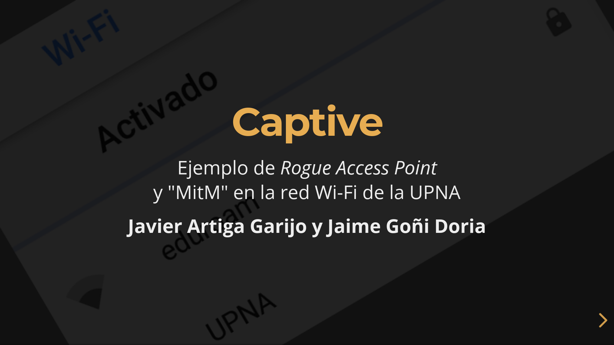

# ./captive.sh

Proyecto final para la asignatura "[Seguridad en Redes y Servicios](https://www.unavarra.es/ficha-asignaturaDOA/?languageId=100000&codPlan=243&codAsig=243707&anio=2018)"

**Captive**: Ejemplo de *Rogue Access Point* y "MitM" en la red Wi-Fi de la UPNA  

* [Presentación](https://jartigag.xyz/captive/)
* [Archivos adjuntos](https://github.com/jartigag/captive/tree/master/src)